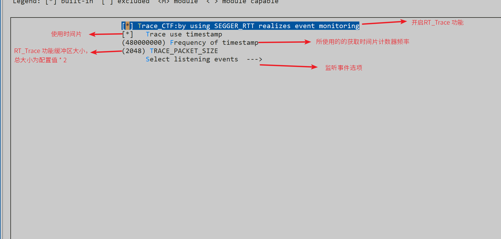
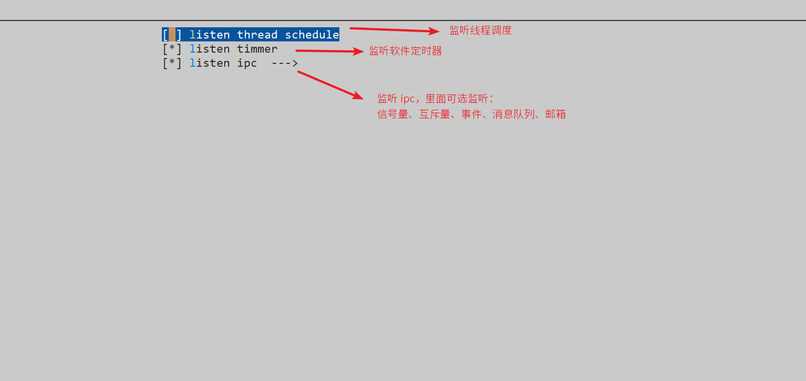

# 使用指南

## RT_Trace 配置选项

使用 menuconfig 打开 RT_Trace 功能，配置页面及注释如下图：



监听事件选项配置页面及注释如下图：



## 代码初始化

配置完毕后，还需要在代码中做以下修改：
1. 需要在`main`函数中，调用`rt_hw_jlink_rtt_init();`函数，对 RT_Trace 功能进行初始化。

2. 需要在代码中自己重新实现`rt_trace_get_time`函数替换原先的弱函数，函数原型如下：

```c
/** 获取时间片
 * 返回值：时间片
**/
rt_uint32_t rt_trace_get_time(void);
```

【注意】：自己实现的获取时间戳功能的计数器频率，需和 menuconfig 页面中时间戳频率一致。

### 示例代码

**平台：ART-Pi**

```c
#define DWT_CR       *((rt_uint32_t *)0xE0001000)
#define DWT_CYCCNT   *((rt_uint32_t *)0xE0001004)
#define DEM_CR       *((rt_uint32_t *)0xE000EDFC)
#define DEM_CR_TRCENA      (1<<24)
#define DWT_CR_CYCCNTENA   (1<<0)

/* dwt 初始化 */
void dwt_init(void)
{
    DEM_CR |= DEM_CR_TRCENA;
    DWT_CYCCNT = (rt_uint32_t)0u;
    DWT_CR |= DWT_CR_CYCCNTENA;
}

/* 获取 dwt 计数值 */
rt_uint32_t dwt_ts_get(void)
{
    return ((rt_uint32_t)DWT_CYCCNT);
}

/* 重新实现获取时间戳函数 */
rt_uint32_t rt_trace_get_time(void)
{
    return dwt_ts_get();
}

int main(int argc, char **argv)
{
	/* 初始化 RT_Trace 功能 */
	rt_hw_jlink_rtt_init();
	
	.......
	
	return 0；
}
```

在该示例中，利用了 dwt 获取时间戳，由于 dwt 的频率就是 CPU 主频，所以在配置选项中，时间戳频率输入`480000000`。
